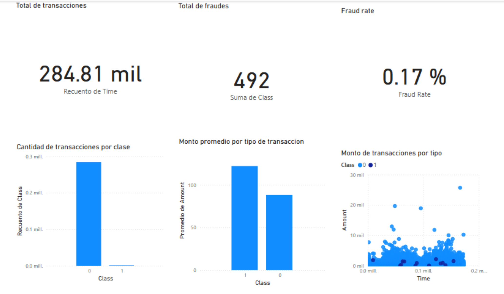

# Análisis de Fraude en Transacciones Financieras

Este proyecto combina **Data Analytics** con Python y **Business Intelligence** con Power BI para identificar patrones de fraude en un dataset de transacciones financieras anonimizadas (284,807 registros).

## Objetivo
Analizar el comportamiento de transacciones fraudulentas frente a las normales para extraer insights que permitan mejorar los sistemas de detección de riesgos bancarios.

## Tecnologías Utilizadas
* **Python**: Procesamiento de datos y Análisis Exploratorio (EDA).
* **Pandas**: Limpieza y manipulación de grandes volúmenes de datos.
* **Matplotlib**: Visualización estadística de montos y distribución de clases.
* **Power BI**: Creación de dashboard interactivo y monitoreo de KPIs financieros.

## Insights Clave
* **Desbalance de datos**: Solo el 0.17% de las transacciones son fraude, lo que representa un reto clásico de analítica financiera.
* **Comportamiento de montos**: Se identificaron anomalías en los montos promedio de fraude en comparación con las transacciones legítimas.
* **Monitoreo**: El dashboard permite visualizar el *Fraud Rate* y el volumen de transacciones en tiempo real.

## Estructura del Proyecto
* `main.py`: Script de Python para el análisis y limpieza.
* `Analisis_Fraude.pbix`: Archivo de Power BI (dentro del repo).
* El dataset original se puede obtener en Kaggle (Credit Card Fraud Detection).
